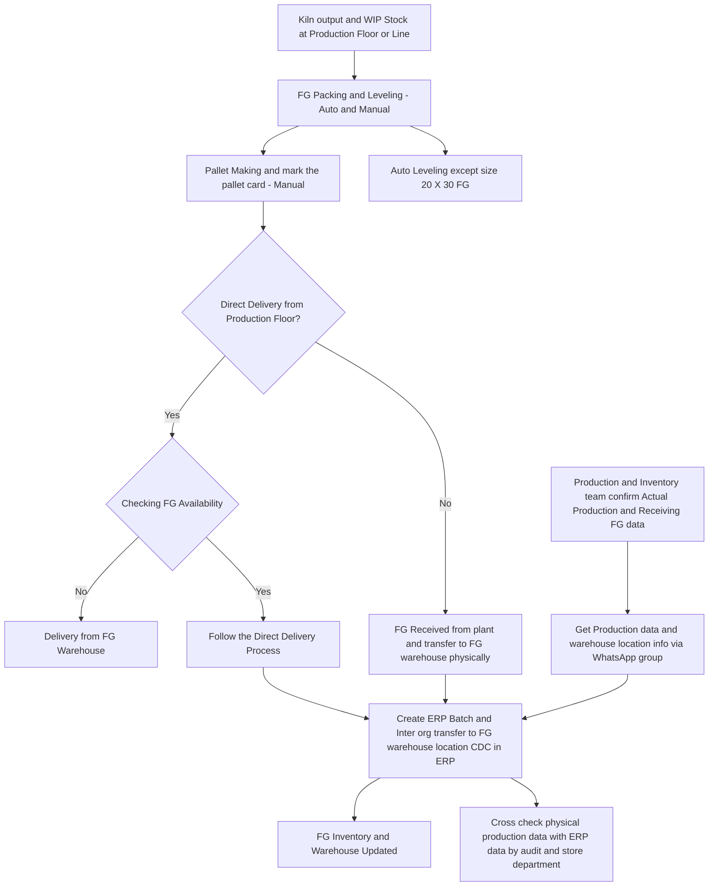

# FG Production Floor to Warehouse Operation Process Flow (AS-IS)

## Document Control

| Version | Date | Author | Changes |
|---------|------|--------|---------|
| 1.0 | 2026-02-15 | Operations Team | Initial AS-IS documentation |

## 1. Executive Summary
This document outlines the current (AS-IS) operational process for Finished Goods (FG) moving from the production floor to the warehouse at the manufacturing facility. The process involves multiple departments including Production, Quality Control, Inventory Management, and Warehouse Operations.

**Key Terms:**
- FG: Finished Goods
- ERP: Enterprise Resource Planning (SAP/Oracle)
- CDC: Central Distribution Center
- WIP: Work In Progress
- SKU: Stock Keeping Unit
- QA: Quality Assurance
- GRN: Goods Receipt Note

## 2. Process Overview

### 2.1 Current State Flowchart

Version

