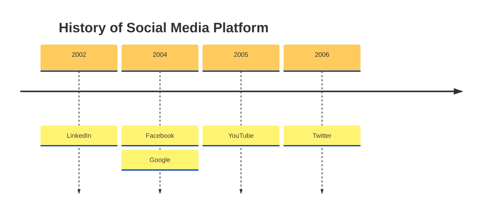
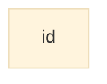
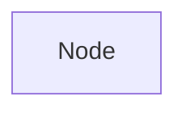
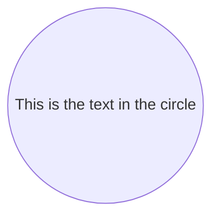

```mermaid
graph TD;
    A-->B;
    A-->C;
    B-->D;
    C-->D;
```

$\frac{d}{dx}\left( \int_{0}^{x} f(t)\,dt \right) = f(x)$

$$
\frac{d}{dx}\left( \int_{0}^{x} f(t)\,dt \right) = f(x)
$$

---

```mermaid
%%{init: {
  "logLevel": "debug",
  "theme": "base",
  "timeline": {
    "disableMulticolor": true
  }
}}%%

timeline
    title History of Social Media Platform
    2002 : LinkedIn
    2004 : Facebook : Google
    2005 : YouTube
    2006 : Twitter
```

```mermaid
%%{init: {"theme": "base"}}%%

flowchart LR
    id
```

```mermaid
flowchart LR
    A["Node"]
```

```mermaid

flowchart LR
    id1((This is the text in the circle))


```

